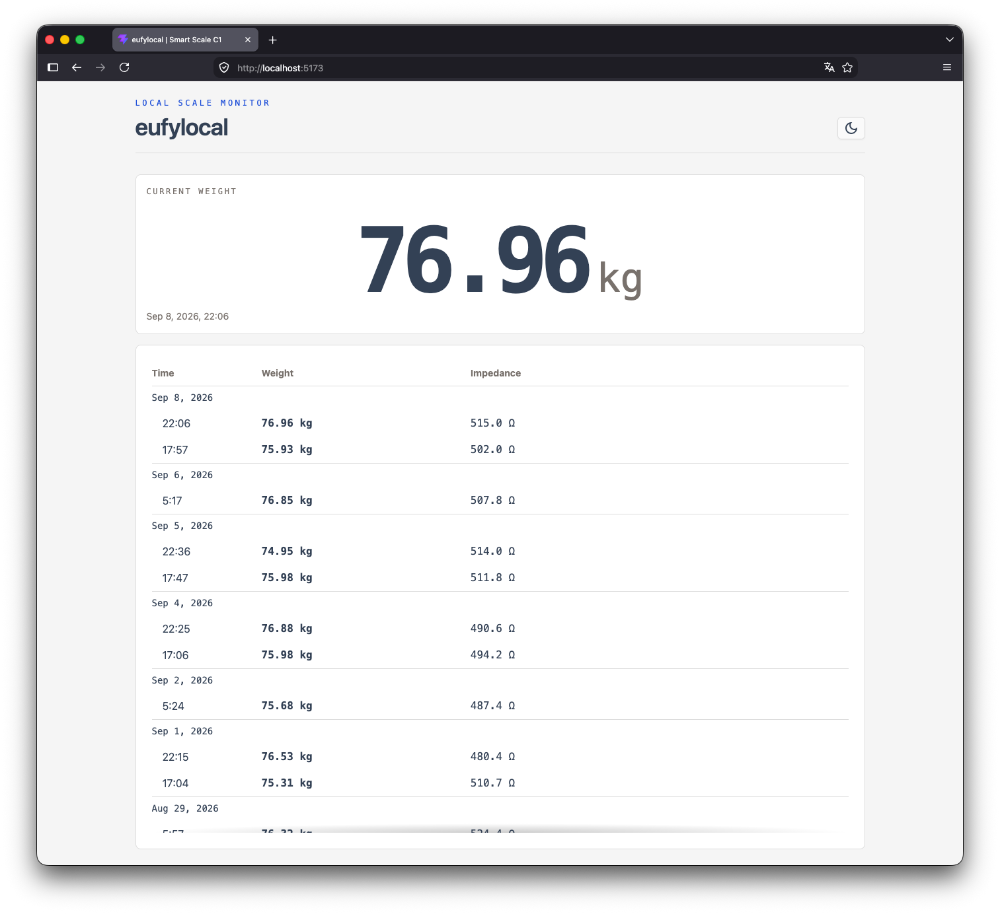
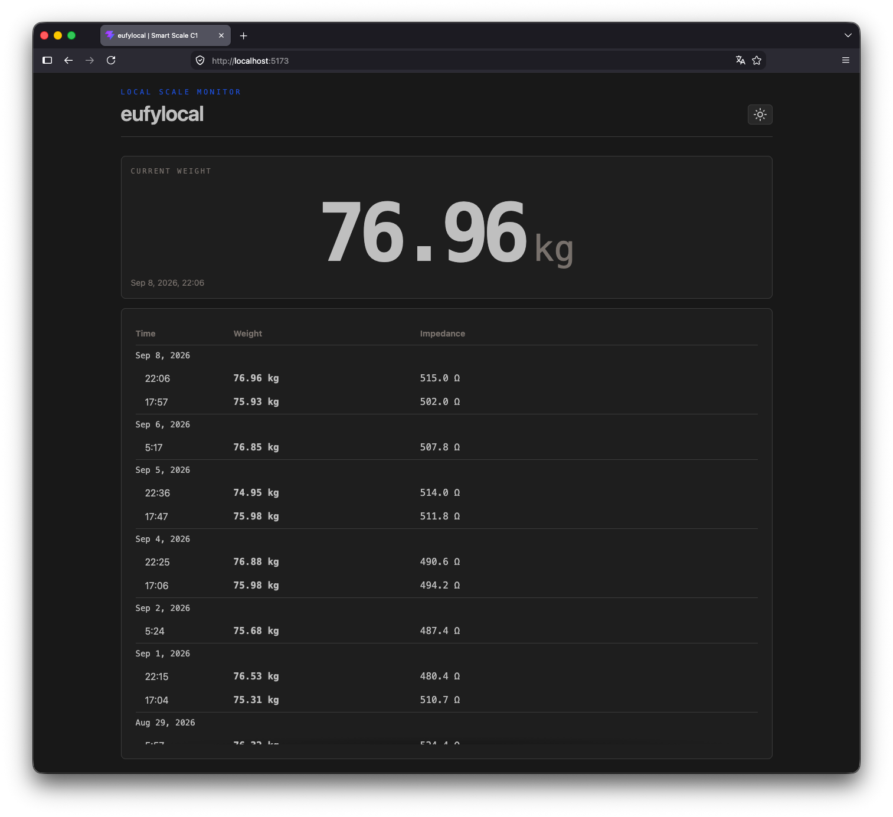

# eufylocal

A web app for the **Eufy Smart Scale C1 (T9146)**





## Requirements

* Python 3.14
* [uv](https://docs.astral.sh/uv/)
* Node.js and npm
* PostgreSQL 16

## Installation


```bash
make install
```

This installs both the Python dependencies with `uv` and the frontend dependencies with `npm`.

Create the local configuration:

```bash
cp .env.example .env
```

Start the local PostgreSQL service before running the application:

```bash
make db-start
```

## Running The Server

```bash
make run
```

The server listens on `127.0.0.1:8000` by default. Open
<http://127.0.0.1:8000> in a browser.

For frontend development, run both Vite and the API server:

```bash
make dev
```

Open <http://127.0.0.1:5173>. Vite proxies `/api` requests to the FastAPI server on port `8000`.
The backend continues to serve the last production frontend build at port `8000`.

Build the production Vue application and Python distributions with:

```bash
make build
```

The Vite output is written to `eufylocal/static/` and packaged into the Python wheel.

## Configuration

Settings are loaded from environment variables and the `.env` file in the working directory.
Environment variables take precedence over values in `.env`.

```dotenv
EUFYLOCAL_DEBUG=false
EUFYLOCAL_HOST=127.0.0.1
EUFYLOCAL_PORT=8000
EUFYLOCAL_DB_HOST=127.0.0.1
EUFYLOCAL_DB_PORT=5432
EUFYLOCAL_DB_NAME=eufylocal
EUFYLOCAL_DB_USER=eufylocal
EUFYLOCAL_DB_PASSWORD=eufylocal
```

## Database Migrations

Apply Alembic migrations before running the application:

```bash
make db-up
```

All SQLAlchemy and Alembic files are contained in `eufylocal/db/`.

Generate 2-3 development measurements on 3-4 days of the last week:

```bash
make db-seed
```

Use `make db-seed WEEKS=12` to generate the same sampling pattern across a longer period. The
command only connects to PostgreSQL on localhost and replaces all existing measurements.

## HTTP API

* `GET /api/measurements/?limit=50` returns measurements in descending timestamp order.
* `GET /api/measurements/latest` returns the latest measurement or `null`.
* `GET /api/sse/` streams a ready message, a status message for each frame while a weighing
  stabilizes, and a single refresh message once the final frame is stored.

## T9146 Protocol

A measurement frame is 11 bytes and starts with `CF`:

| Byte | Meaning |
| ---- | ------- |
| 0 | `0xCF` marker |
| 1-2 | Little-endian impedance divided by 10, in ohms |
| 3-4 | Little-endian weight divided by 100, in kilograms |
| 8 | Display-unit bit 0: 0 for kg, 1 for lb |
| 9 | Status: `0x00` is stable, `0x02` means the weight limit was exceeded |
| 10 | XOR checksum of bytes 0-9 |

Bleak exposes the manufacturer identifier separately from its data. The data ends with the
`0x9146` model marker and contains the 11-byte frame. The scanner reads advertising packets
only and never opens a GATT connection. Weight is decoded from the frame and `unit`
contains the display unit (`kg` or `lb`).

## Quality Checks

```bash
make check
```
